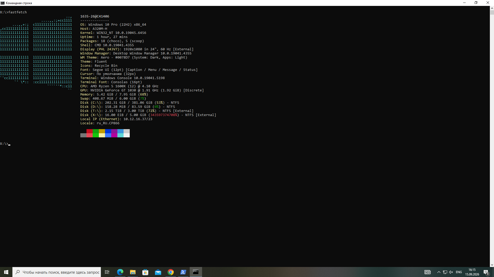
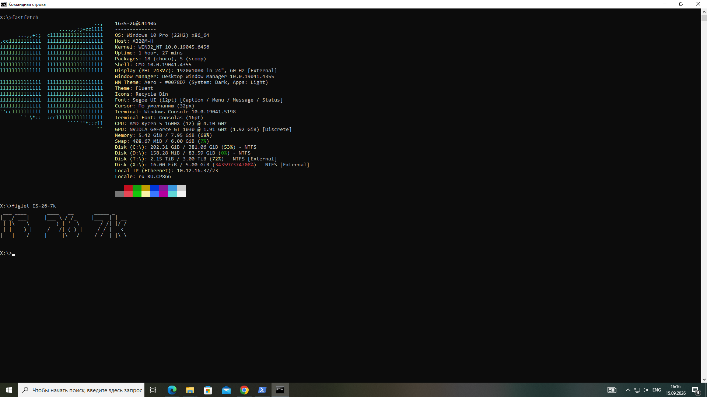

#TERMINAL_PROTOCOLS / Темы 

> **Дата:** 15.09.2026  
> **Автор (ФИО):** Елисеев Максим Владимирович

## ВЫПОЛНЕННЫЕ ШАГИ
1. Освоена навигация в системе через команды.
2. Создана и очищена структура папок 'Лабиринт'.
3. Установлены и протестированы утилиты визуализации.

 ## ЛАБИРИНТ
[Открыть текстовый файл](labirint.txt)

## ОТЧЕТ СИСТЕМЫ
### Системная информация

### Красивый текст

### Сообщение от Cowsay
